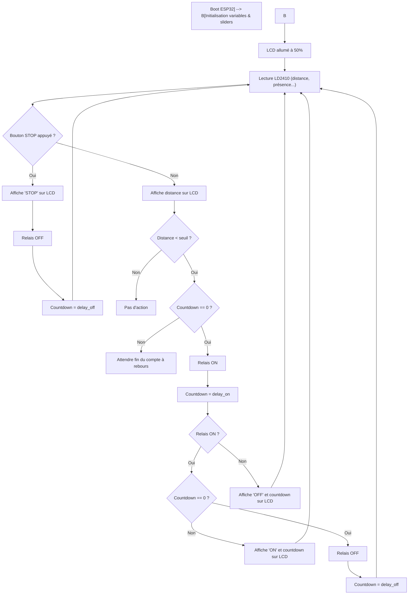
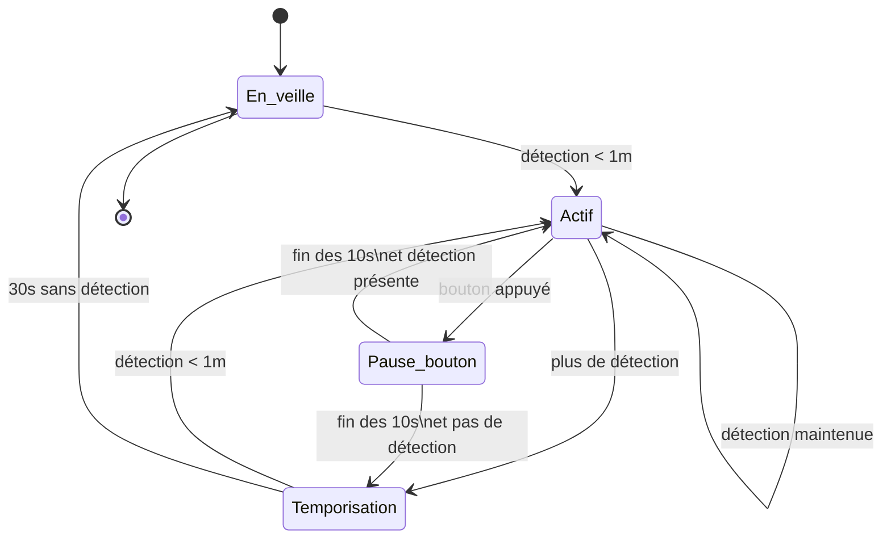

# AutoStopStart

Ajouter un mécanisme de marche/arrêt à un automate en fonction de la position des visiteurs et de l'action sur un bouton d'arrêt d'urgence. Le mécanisme doit être priorisé pour un réactivité maximale.

## Principes

### États du système

| État            | Description                                                       |
| --------------- | ----------------------------------------------------------------- |
| `En_veille`     | Mécanisme à l’arrêt, en attente de détection de présence à < 1 m. |
| `Actif`         | Mécanisme en fonctionnement pendant la présence.                  |
| `Pause_bouton`  | Pause temporaire de 10 secondes après appui sur le bouton.        |
| `Temporisation` | Délai de 30 secondes sans détection avant arrêt complet.          |

### Règles de transition

| État actuel     | Événement                      | État suivant    | Action                       |
| --------------- | ------------------------------ | --------------- | ---------------------------- |
| `En_veille`     | Détection d’un visiteur < 1 m  | `Actif`         | Démarrer le mécanisme        |
| `Actif`         | Bouton appuyé                  | `Pause_bouton`  | Arrêter le mécanisme 10s     |
| `Actif`         | Plus de détection              | `Temporisation` | Lancer le timer de 30s       |
| `Actif`         | Présence maintenue             | `Actif`         | Maintenir actif, reset timer |
| `Pause_bouton`  | Fin des 10s, présence détectée | `Actif`         | Redémarrer le mécanisme      |
| `Pause_bouton`  | Fin des 10s, aucune détection  | `Temporisation` | Lancer le timer de 30s       |
| `Temporisation` | Détection < 1 m                | `Actif`         | Redémarrer le mécanisme      |
| `Temporisation` | 30s écoulées sans détection    | `En_veille`     | Arrêt complet                |




### Diagramme de la machine à états

```mermaid
   [En_veille]
       |
   (détection <1m)
       ↓
     [Actif] <-------------------------+
       |       (présence continue)    |
       |                              |
       |                             (détection <1m)
  (plus de détection)                 ↑
       ↓                              |
[Temporisation]                       |
       |      (aucune détection 30s)  |
       ↓                              |
   [En_veille]                        |
       ↑                              |
       |                              |
 (bouton appuyé)                      |
       ↓                              |
 [Pause_bouton] (10s) ----------------+
       ↓
 (fin pause)
       ↓
(présence?) → Actif / Temporisation
```


## ESPHome

### Matériel supposé
* LD2410 connecté en UART
* Bouton sur une GPIO avec pull-up
* Mécanisme contrôlé via une GPIO (par exemple un relais)
* ESP32 recommandé (UART + timers + RAM)

### Fonctionnalité
- Actif si présence < 1m
- Bouton = pause 10s
- Timeout d’absence = 30s
- Redémarrage auto si présence persiste après la pause
