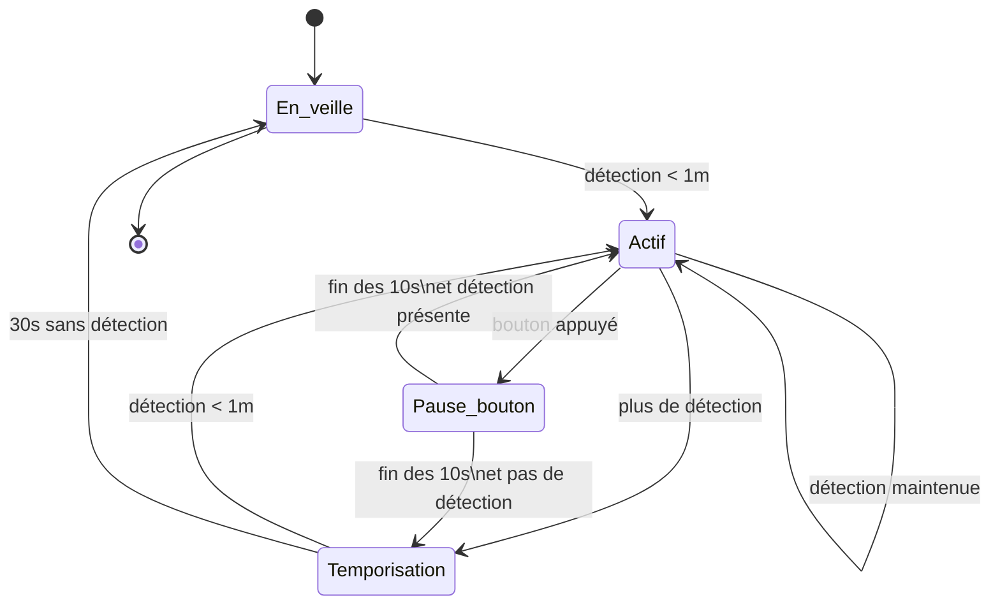

# emergency_stop

Ajouter un mécanisme de marche/arrêt à un automate en fonction de la position des visiteurs et de l'action sur un bouton d'arrêt d'urgence.

## Principes

### États du système

| État            | Description                                                       |
| --------------- | ----------------------------------------------------------------- |
| `En_veille`     | Mécanisme à l’arrêt, en attente de détection de présence à < 1 m. |
| `Actif`         | Mécanisme en fonctionnement pendant la présence.                  |
| `Pause_bouton`  | Pause temporaire de 10 secondes après appui sur le bouton.        |
| `Temporisation` | Délai de 30 secondes sans détection avant arrêt complet.          |

### Règles de transition

| État actuel     | Événement                      | État suivant    | Action                       |
| --------------- | ------------------------------ | --------------- | ---------------------------- |
| `En_veille`     | Détection d’un visiteur < 1 m  | `Actif`         | Démarrer le mécanisme        |
| `Actif`         | Bouton appuyé                  | `Pause_bouton`  | Arrêter le mécanisme 10s     |
| `Actif`         | Plus de détection              | `Temporisation` | Lancer le timer de 30s       |
| `Actif`         | Présence maintenue             | `Actif`         | Maintenir actif, reset timer |
| `Pause_bouton`  | Fin des 10s, présence détectée | `Actif`         | Redémarrer le mécanisme      |
| `Pause_bouton`  | Fin des 10s, aucune détection  | `Temporisation` | Lancer le timer de 30s       |
| `Temporisation` | Détection < 1 m                | `Actif`         | Redémarrer le mécanisme      |
| `Temporisation` | 30s écoulées sans détection    | `En_veille`     | Arrêt complet                |

### Diagramme de la machine à états

```
   [En_veille]
       |
   (détection <1m)
       ↓
     [Actif] <-------------------------+
       |       (présence continue)    |
       |                              |
       |                             (détection <1m)
  (plus de détection)                ↑
       ↓                            |
[Temporisation]                     |
       |      (aucune détection 30s)|
       ↓                            |
   [En_veille]                      |
       ↑                            |
       |                            |
 (bouton appuyé)                    |
       ↓                            |
 [Pause_bouton] (10s) --------------+
       ↓
 (fin pause)
       ↓
(présence?) → Actif / Temporisation
```


## ESPHome

### Matériel supposé
* LD2410 connecté en UART
* Bouton sur une GPIO avec pull-up
* Mécanisme contrôlé via une GPIO (par exemple un relais)
* ESP32 recommandé (UART + timers + RAM)

### Fonctionnalité
- Actif si présence < 1m
- Bouton = pause 10s
- Timeout d’absence = 30s
- Redémarrage auto si présence persiste après la pause

### Code 

```yaml
esphome:
  name: automate_ld2410
  platform: ESP32
  board: esp32dev

# Réseau et logs
wifi:
  ssid: "your_wifi"
  password: "your_password"
logger:

# Web (optionnel)
web_server:

# API Home Assistant (optionnel)
api:
ota:

# UART pour LD2410
uart:
  rx_pin: GPIO16
  tx_pin: GPIO17
  baud_rate: 256000

ld2410:
  id: radar

binary_sensor:
  - platform: gpio
    id: bouton_pause
    pin:
      number: GPIO4
      mode: INPUT_PULLUP
      inverted: true
    on_press:
      then:
        - script.execute: pause_bouton

output:
  - platform: gpio
    pin: GPIO2
    id: moteur

switch:
  - platform: output
    id: moteur_switch
    output: moteur

sensor:
  - platform: ld2410
    moving_distance:
      id: distance

globals:
  - id: presence_detected
    type: bool
    restore_value: no
    initial_value: "false"

  - id: timer_absence
    type: int
    restore_value: no
    initial_value: "0"

  - id: pause_active
    type: bool
    restore_value: no
    initial_value: "false"

script:
  - id: pause_bouton
    mode: restart
    then:
      - logger.log: "Pause bouton activée"
      - globals.set:
          id: pause_active
          value: "true"
      - switch.turn_off: moteur_switch
      - delay: 10s
      - if:
          condition:
            lambda: 'return id(distance).state < 1.0;'
          then:
            - logger.log: "Présence toujours là, redémarrage"
            - switch.turn_on: moteur_switch
            - globals.set:
                id: presence_detected
                value: "true"
          else:
            - logger.log: "Pas de présence, entrée dans temporisation"
            - globals.set:
                id: presence_detected
                value: "false"
      - globals.set:
          id: pause_active
          value: "false"

interval:
  - interval: 1s
    then:
      - if:
          condition:
            lambda: 'return !id(pause_active);'
          then:
            - lambda: |-
                if (id(distance).state < 1.0) {
                  if (!id(presence_detected)) {
                    id(moteur_switch).turn_on();
                    id(presence_detected) = true;
                    id(timer_absence) = 0;
                  } else {
                    id(timer_absence) = 0;
                  }
                } else {
                  if (id(presence_detected)) {
                    id(timer_absence) += 1;
                    if (id(timer_absence) >= 30) {
                      id(moteur_switch).turn_off();
                      id(presence_detected) = false;
                      id(timer_absence) = 0;
                    }
                  }
                }
```
