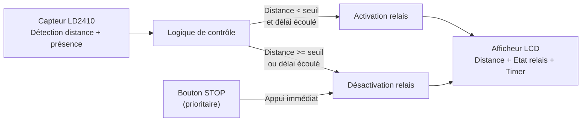
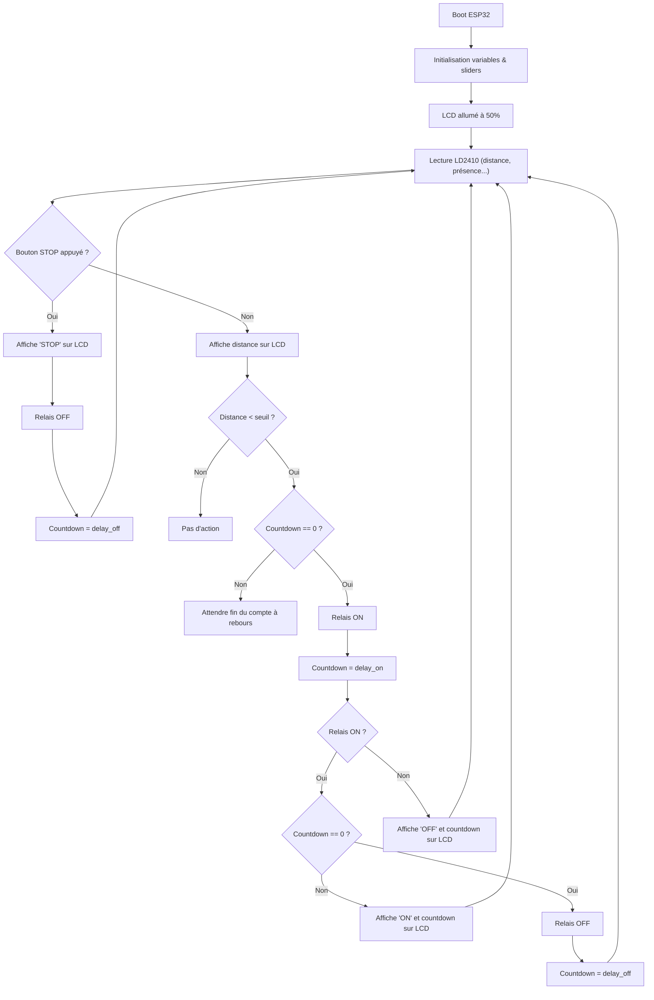
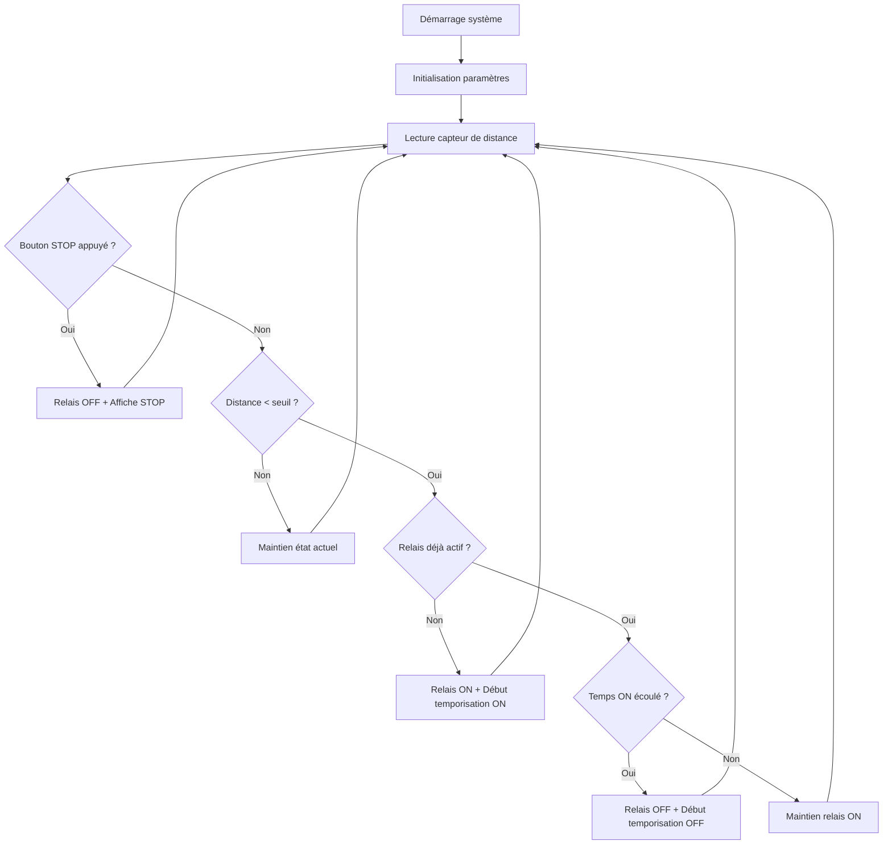
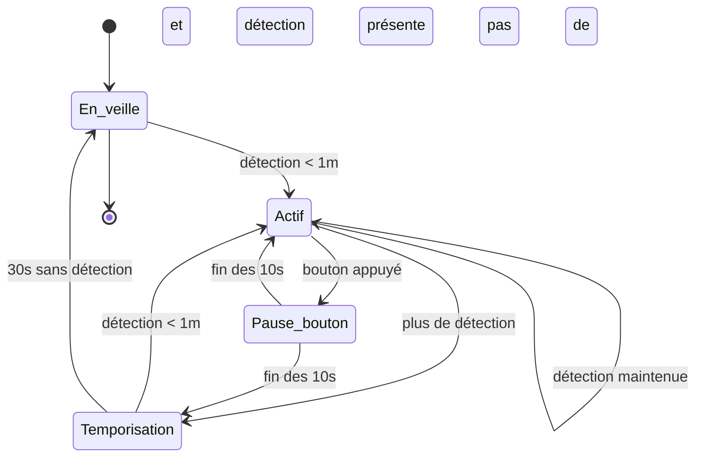

# 🚀 AutoStopStart ESPHome

## 📖 Description
Ce projet **ESPHome** utilise un capteur **LD2410** pour mesurer la distance et détecter une présence.  
En fonction d’un seuil défini et de temporisations configurables, un **relais** est activé ou désactivé automatiquement.  
Un **bouton STOP** permet d’interrompre immédiatement le système en toute sécurité.  
Un écran **LCD I2C** affiche l’état du relais, la distance mesurée et un compte à rebours.

---

## ⚙️ Matériel requis
- ESP32 DevKit  
- Capteur **LD2410** (radar présence + distance)  
- Relais commandé en GPIO  
- Écran **LCD 16x2** (via PCF8574 en I2C)  
- Bouton poussoir (arrêt d’urgence)  
- Alimentation 5V  

---

## 🔧 Installation
1. Installer [ESPHome](https://esphome.io/) sur votre machine.  
2. Copier la configuration YAML (`autostopstart.yaml`) dans votre projet ESPHome.  
3. Adapter si nécessaire les **GPIO** (LCD, bouton, relais, LD2410).  
4. Compiler et flasher le firmware sur l’ESP32.  
5. Configurer le Wi-Fi via le **portail captif** ou via l’interface **improv_serial**.  

---

## 📊 Schéma bloc fonctionnel

---

## 🔁 Flowchart détaillé

---

## 🔁 Flowchart simplifié

---

## 🛑 Gestion du bouton STOP
- Le bouton est câblé en **GPIO23** avec **pull-up** et inversion logique.  
- Lors d’un **appui**, l’ESP32 :  
  1. Coupe immédiatement le relais (`relay OFF`).  
  2. Réinitialise le compteur OFF (`countdown = delay_off`).  
  3. Affiche **STOP** sur le LCD.  

⚡ **Priorité absolue** : cette logique est traitée **immédiatement** via `on_press:` et ne dépend pas du cycle d’affichage du LCD.  

---

## 🔀 États du système

| État            | Description                                                       |
| --------------- | ----------------------------------------------------------------- |
| `En_veille`     | Mécanisme à l’arrêt, en attente de détection de présence < 1 m.   |
| `Actif`         | Mécanisme en fonctionnement pendant la présence.                  |
| `Pause_bouton`  | Pause temporaire de 10 secondes après appui sur le bouton.        |
| `Temporisation` | Délai de 30 secondes sans détection avant arrêt complet.          |

---

## 🔄 Règles de transition

| État actuel     | Événement                      | État suivant    | Action                       |
| --------------- | ------------------------------ | --------------- | ---------------------------- |
| `En_veille`     | Détection d’un visiteur < 1 m  | `Actif`         | Démarrer le mécanisme        |
| `Actif`         | Bouton appuyé                  | `Pause_bouton`  | Arrêter le mécanisme 10s     |
| `Actif`         | Plus de détection              | `Temporisation` | Lancer le timer de 30s       |
| `Actif`         | Présence maintenue             | `Actif`         | Maintenir actif, reset timer |
| `Pause_bouton`  | Fin des 10s, présence détectée | `Actif`         | Redémarrer le mécanisme      |
| `Pause_bouton`  | Fin des 10s, aucune détection  | `Temporisation` | Lancer le timer de 30s       |
| `Temporisation` | Détection < 1 m                | `Actif`         | Redémarrer le mécanisme      |
| `Temporisation` | 30s écoulées sans détection    | `En_veille`     | Arrêt complet                |

---

## 📐 Diagramme machine à états

---

## ⚙️ Paramètres configurables
Depuis Home Assistant (ou via API ESPHome), il est possible de régler :  
- ⏱️ **Delay ON (s)** : durée d’activation relais après détection.  
- ⏱️ **Delay OFF (s)** : durée d’inhibition relais après extinction.  
- 📏 **Distance (cm)** : seuil de déclenchement du relais.  

---

## 📌 Fonctionnalité
- ✅ Actif si présence < 1m  
- ✅ Bouton = pause 10s  
- ✅ Timeout d’absence = 30s  
- ✅ Redémarrage auto si présence persiste après la pause  

---

## 👤 Auteur
Projet développé avec **ESPHome + ESP32 + LD2410**, optimisé et documenté pour usage personnel ou domotique.
